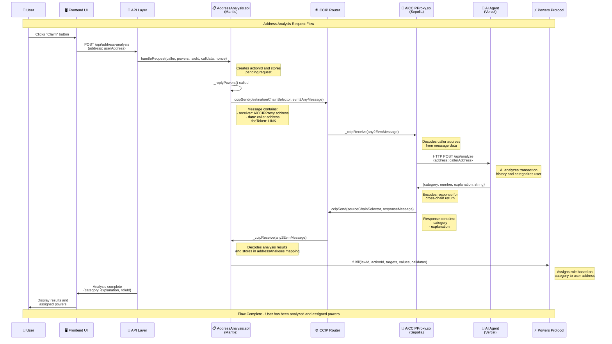

# <div align="center">Mantle Hackathon Project</div>


### <div align="center">Mantle Hackathon</div>

<!-- PROJECT LOGO -->
<br />
<div align="center">
  <a href="https://github.com/7Cedars/mantle_hackathon"> 
    
  </a>

<h3 align="center">Powers</h3>
  <p align="center">
    An AI-powered cross-chain address analysis system that integrates with the Powers governance protocol  
    <br />
    <!--NB: TO DO -->  
    <a href="/contracts">Solidity protocol</a> ·
    <a href="https://sepolia.mantlescan.xyz/address/0xe9D450BBcE3f1c4524FcAC0190C9F75b6c67833B">Proof of Concept (mantle)</a> ·
    <a href="https://mantle-ai-powers.vercel.app/">Live Demo</a>
  </p>
</div>

<div align="center">
  For an introduction into the protocol, see
   <a href="https://www.tella.tv/video/powers-1-aijc"><b> the 2 minute project pitch</b>. </a>
</div>

## About

This project demonstrates a sophisticated cross-chain architecture that combines AI analysis with blockchain governance. It analyzes user wallet addresses across multiple chains, categorizes their on-chain behavior, and assigns appropriate governance roles through the Powers protocol on Mantle Network.

## Use Cases

The system enables three key patterns that solve common DAO and governance challenges:

**🔍 Cross-Chain Identity Analysis**: Analyze user behavior across multiple blockchain networks to create comprehensive user profiles. The AI agent examines transaction history, DeFi interactions, NFT holdings, and social patterns to categorize users into meaningful governance roles.

**🌐 Cross-Chain Communication**: Leverage Chainlink CCIP to enable secure, trustless communication between Mantle Network and other EVM chains. This allows the system to gather data from multiple sources while maintaining security and decentralization.

**⚡ AI-Enhanced Governance**: Integrate AI analysis with the Powers governance protocol to automatically assign roles based on user behavior patterns. This creates a more dynamic and responsive governance system that adapts to user activity.

## Deploy locally

### Prerequisites

1. **Install Foundry** - Required for smart contract development  
   ```bash
   curl -L https://foundry.paradigm.xyz | bash
   foundryup
   ```

2. **Install Node.js dependencies**  
   ```bash
   yarn install
   cd frontend && yarn install
   cd ../ai_client && yarn install
   ```

### Setup and Deployment

1. **Clone and setup the repository**  
   ```bash
   git clone <repository-url>
   cd mantle-hackathon
   ```

2. **Configure environment variables**  
   ```bash
   cp contracts/.env.example contracts/.env
   cp frontend/.env.example frontend/.env
   cp ai_client/.env.example ai_client/.env
   ```
   
   Fill in the required environment variables for RPC endpoints, API keys, and contract addresses.

3. **Start local development chain**  
   ```bash
   anvil
   ```

4. **Deploy contracts**  
   ```bash
   cd contracts
   make anvilDeployAll
   ```
   This deploys all contracts to your local Anvil chain.

5. **Start the AI client**  
   ```bash
   cd ai_client
   yarn dev
   ```

6. **Start the frontend application**  
   ```bash
   cd frontend
   yarn dev
   ```

7. **Access the application**  
   - Frontend: Open your browser and navigate to `http://localhost:3000`
   - AI Client: Available at `http://localhost:3001`
   - Select "Anvil" from the chain dropdown for local development

## Address Analysis System Architecture Flow

The system implements a sophisticated cross-chain architecture that combines AI analysis with blockchain governance:



### System Components

**🔗 Cross-Chain Communication**
- **Mantle → Sepolia**: CCIP Router handles cross-chain message passing
- **LINK Tokens**: Used for paying CCIP fees
- **Message Encoding**: ABI encoding for contract-to-contract communication

**🧠 AI Analysis Process**
1. **Address Input**: User's wallet address
2. **Transaction History**: AI fetches and analyzes on-chain activity
3. **Categorization**: Assigns one of 7 categories (DeFi, Gaming, Social, etc.)
4. **Explanation**: Provides reasoning for the categorization

**⚡ Powers Protocol Integration**
- **Role Assignment**: Category becomes roleId in Powers protocol
- **Governance Rights**: User gains specific powers based on their category
- **On-Chain Verification**: All assignments are recorded on Mantle blockchain

## Important files and folders

```
.
├── contracts/         # Smart contract development
│   ├── src/          # Solidity contracts and interfaces
│   │   ├── AddressAnalysis.sol      # Main analysis contract on Mantle
│   │   ├── AiCCIPProxy.sol          # CCIP proxy for AI integration
│   │   ├── AiProxy.sol              # AI service proxy
│   │   ├── CCIPSendReceive.sol      # CCIP sender/receiver contracts
│   │   ├── CCIPReceiveSend.sol      # Cross-chain communication
│   │   ├── abstracts/               # Abstract contract implementations
│   │   ├── interfaces/              # Contract interfaces
│   │   └── libraries/               # Shared libraries
│   ├── test/         # Foundry test files
│   ├── script/       # Deployment scripts
│   ├── broadcast/    # Deployment artifacts
│   └── foundry.toml  # Foundry configuration
│
├── frontend/         # Next.js dApp workspace
│   ├── app/          # Next.js app router pages and components
│   ├── components/   # Reusable React components
│   ├── config/       # Configuration files and ABIs
│   ├── hooks/        # Custom React hooks
│   ├── public/       # Static assets for the dApp
│   ├── utils/        # Utility functions
│   └── package.json  # Frontend dependencies
│
├── ai_client/        # AI analysis service
│   ├── app/          # Next.js API routes
│   ├── ai_context/   # AI prompt templates and context
│   ├── components/   # AI service components
│   └── package.json  # AI service dependencies
│
├── .gitmodules       # Git submodule configuration
└── README.md         # This file
```

## Built With

### Smart Contracts
- **Solidity 0.8.26** - Smart contract development
- **Foundry 0.2.0** - Development framework
- **OpenZeppelin 5.0.2** - Security libraries
- **Chainlink CCIP** - Cross-chain communication
- **Powers Protocol** - Governance framework

### Frontend
- **React 18** - UI framework
- **NextJS 14** - Full-stack framework
- **Tailwind CSS** - Styling
- **Wagmi / Viem** - Ethereum interactions
- **Privy.io** - Authentication

### AI Service
- **Google Gemini** - AI analysis engine
- **Model Context Protocol** - AI integration
- **Next.js API Routes** - Backend services

## License

Distributed under the MIT License. See `LICENSE.txt` for more information.

## Contact

Seven Cedars - [Github profile](https://github.com/7Cedars) - cedars7@proton.me
