# Address Analysis System Architecture Flow

## Complete Request Flow

```mermaid
sequenceDiagram
    participant User as 👤 User
    participant UI as 🖥️ Frontend UI
    participant API as 🔌 API Layer
    participant AA as 📋 AddressAnalysis.sol<br/>(Mantle)
    participant Router as 🌐 CCIP Router
    participant AICP as 🤖 AiCCIPProxy.sol<br/>(Sepolia)
    participant AI as 🧠 AI Agent<br/>(Vercel)
    participant Powers as ⚡ Powers Protocol

    Note over User, Powers: Address Analysis Request Flow

    %% Step 1: User initiates request
    User->>UI: Clicks "Claim" button
    UI->>API: POST /api/address-analysis<br/>{address: userAddress}
    
    %% Step 2: API processes and calls contract
    API->>AA: handleRequest(caller, powers, lawId, calldata, nonce)
    Note right of AA: Creates actionId and stores<br/>pending request
    
    %% Step 3: AddressAnalysis triggers CCIP
    AA->>AA: _replyPowers() called
    AA->>Router: ccipSend(destinationChainSelector, evm2AnyMessage)
    Note right of AA: Message contains:<br/>- receiver: AiCCIPProxy address<br/>- data: caller address<br/>- feeToken: LINK
    
    %% Step 4: CCIP Router forwards to Sepolia
    Router->>AICP: _ccipReceive(any2EvmMessage)
    Note right of AICP: Decodes caller address<br/>from message data
    
    %% Step 5: AiCCIPProxy calls AI Agent
    AICP->>AI: HTTP POST /api/analyze<br/>{address: callerAddress}
    Note right of AI: AI analyzes transaction<br/>history and categorizes user
    
    %% Step 6: AI Agent responds with analysis
    AI->>AICP: {category: number, explanation: string}
    Note right of AICP: Encodes response for<br/>cross-chain return
    
    %% Step 7: AiCCIPProxy sends response back via CCIP
    AICP->>Router: ccipSend(sourceChainSelector, responseMessage)
    Note right of AICP: Response contains:<br/>- category<br/>- explanation
    
    %% Step 8: CCIP Router forwards back to Mantle
    Router->>AA: _ccipReceive(any2EvmMessage)
    Note right of AA: Decodes analysis results<br/>and stores in addressAnalyses mapping
    
    %% Step 9: AddressAnalysis fulfills Powers protocol
    AA->>Powers: fulfill(lawId, actionId, targets, values, calldatas)
    Note right of Powers: Assigns role based on<br/>category to user address
    
    %% Step 10: Frontend receives completion
    API->>UI: Analysis complete<br/>{category, explanation, roleId}
    UI->>User: Display results and<br/>assigned powers

    Note over User, Powers: Flow Complete - User has been analyzed and assigned powers
```

## System Components

### 🔗 **Cross-Chain Communication**
- **Mantle → Sepolia**: CCIP Router handles cross-chain message passing
- **LINK Tokens**: Used for paying CCIP fees
- **Message Encoding**: ABI encoding for contract-to-contract communication

### 🧠 **AI Analysis Process**
1. **Address Input**: User's wallet address
2. **Transaction History**: AI fetches and analyzes on-chain activity
3. **Categorization**: Assigns one of 7 categories (DeFi, Gaming, Social, etc.)
4. **Explanation**: Provides reasoning for the categorization

### ⚡ **Powers Protocol Integration**
- **Role Assignment**: Category becomes roleId in Powers protocol
- **Governance Rights**: User gains specific powers based on their category
- **On-Chain Verification**: All assignments are recorded on Mantle blockchain

## Key Features

### 🔒 **Security**
- **Sender Verification**: AiCCIPProxy validates message sources
- **Cross-Chain Authentication**: CCIP ensures message integrity
- **Role-Based Access**: Powers protocol enforces governance rules

### 📊 **Data Flow**
- **Request Tracking**: actionId maps requests to responses
- **State Management**: addressAnalyses mapping stores results
- **Event Emission**: All key events are logged for transparency

### 🚀 **Scalability**
- **Asynchronous Processing**: Non-blocking cross-chain communication
- **Batch Processing**: Multiple requests can be handled simultaneously
- **Gas Optimization**: Efficient contract interactions
